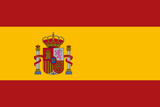
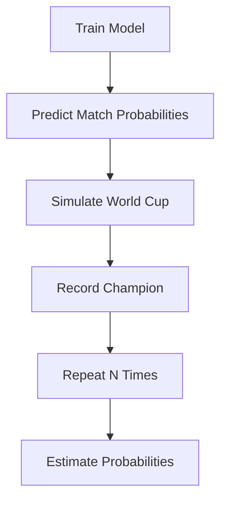

<div align="center">

# ⚽ FIFA World Cup Predictor

**Predicting and simulating FIFA World Cups with machine learning and Monte Carlo simulation**


</div>

<br>

## 📌 Overview

This project estimates match outcome probabilities between national teams and uses those probabilities to simulate complete tournaments — enabling both **retrospective evaluation** of past FIFA World Cups and **forecasting** of future ones.

**Core features used:** EA Sports FIFA game ratings · ELO ratings · FIFA ranking

<br>

## 📑 Table of Contents

- [Historical Performance](#-historical-performance)
- [2026 Forecast](#-fifa-world-cup-2026-forecast)
- [Simulation Methodology](#-simulation-methodology)
- [Supported Models](#-supported-models)
- [Reproducing the Forecast](#-reproducing-the-2026-forecast)
- [Disclaimer](#-disclaimer)

<br>

## 🏆 Historical Performance

The final model was selected through a two-stage evaluation process:

1. **Leave-One-World-Cup-Out Cross Validation**
2. **Tournament-Level Monte Carlo Evaluation**

> The objective isn't just predicting individual matches accurately — it's generating **realistic tournament outcomes**.

### Historical Results — XGBoost

| World Cup | Actual Champion | Predicted Champion | Champion Probability |
| :-------: | :--------------- | :------------------ | :-------------------: |
| 2006      | Italy             | 🥈 France            | 4.94%                 |
| 2010      | Spain             | ✅ Spain             | 33.71%                |
| 2014      | Germany           | ✅ Germany           | 19.84%                |
| 2018      | France            | Brazil               | 24.38%                |
| 2022      | Argentina         | ✅ Argentina         | 20.17%                |

### Evaluation Metrics

<div align="center">

| Metric | Value |
| :----- | :---: |
| Average Log Loss | 1.961 |
| Tournament Loss | 1.938 |
| 🏆 Champions Correctly Predicted | 3 / 5 |
| 4️⃣ Real Champion in Top 4 Favorites | 4 / 5 |

</div>

<br>

---

## 🔮 FIFA World Cup 2026 Forecast

After training on all completed World Cups and running Monte Carlo simulations, the project generates title probabilities for every team in the 2026 tournament.

<div align="center">

| | Team | Title Probability |
| :---: | :--- | :---: |
|  | **Spain** | 🥇 24.82% |
|  | **France** | 🥈 19.67% |
|  | **England** | 🥉 14.13% |
|  | **Portugal** | 12.07% |

</div>

Probabilities come from **1,000,000 tournament simulations** using FIFA's new 48-team format, including group-stage qualification of the best third-placed teams and the Round of 32.

<br>

## ⚙️ Simulation Methodology

For each tournament simulation:

```
 1. Group-stage matches simulated from model-predicted probabilities
 2. Group standings calculated
 3. Knockout brackets generated per FIFA rules
 4. Every knockout match simulated
 5. Champion recorded
 6. Repeat N times → Estimate probabilities
```

<div align="center">



</div>

<br>

## 🤖 Supported Models

| Model | Status |
| :---- | :---: |
| Logistic Regression | ✔️ |
| Random Forest | ✔️ |
| XGBoost | ⭐ Selected |
| LightGBM | ✔️ |
| CatBoost | ✔️ |

**XGBoost** delivered the best results across evaluation and was selected for the 2026 World Cup predictions.

<br>

## 🚀 Reproducing the 2026 Forecast

```bash
python -m scripts.run_wc_2026 1000000 42
```

| Argument | Description |
| :------- | :----------- |
| `1000000` | Monte Carlo iterations |
| `42` | Random seed |

Results are exported as **CSV files** with probabilities for:

`Champion` · `Finalist` · `Semifinalist` · `Quarterfinalist` · `Round of 16` · `Round of 32`

<br>

## ⚠️ Disclaimer

This project is intended for **research and educational purposes** only.

<div align="center">

<sub>Made with ⚽ and 🐍</sub>

</div>
