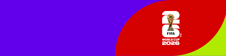
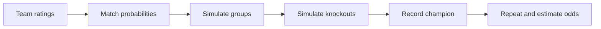

<div align="center">

# ⚽ FIFA World Cup Predictor

### Can a model predict the world's biggest football tournament?

Match probabilities, XGBoost, and Monte Carlo simulations — from historical World Cups to a 48-team tournament.




</div>

## The idea

Predict each match using **EA Sports FIFA ratings, Elo ratings, and FIFA rankings**. Then simulate the entire tournament repeatedly to estimate each team's chances of advancing and winning.

A good match prediction is useful. A realistic **tournament simulation** is the real goal.

## 🏆 Historical evaluation

The model was evaluated with leave-one-World-Cup-out cross-validation and tournament-level simulations. XGBoost was selected from five tested models.

| World Cup | Actual champion | Model's top pick | Reported probability |
| :---: | :--- | :--- | ---: |
| 2006 | Italy | France | 4.94% |
| 2010 | Spain | Spain ✅ | 33.71% |
| 2014 | Germany | Germany ✅ | 19.84% |
| 2018 | France | Brazil | 24.38% |
| 2022 | Argentina | Argentina ✅ | 20.17% |

**Reported results:** 3 of 5 champions predicted · Actual champion among the top four favorites in 4 of 5 tournaments · Average log loss: 1.961 · Tournament loss: 1.938

> The probabilities above are copied from the project's reported results. See the code and output files for how they were calculated.

## 🔮 2026 simulation snapshot

The project's 48-team simulation reported these title probabilities:

| Team | Title probability |
| :--- | ---: |
| 🇪🇸 Spain | 24.82% |
| 🇫🇷 France | 19.67% |
| 🏴 England | 14.13% |
| 🇵🇹 Portugal | 12.07% |

These are **model outputs**, not actual tournament results. Add the run date and input-data cutoff here if you want to present them as a pre-tournament forecast.

## ⚙️ How it works


```mermaid
flowchart LR
    A["Team ratings"] --> B["Match probabilities"]
    B --> C["Simulate groups"]
    C --> D["Simulate knockouts"]
    D --> E["Record champion"]
    E --> F["Repeat and estimate odds"]
```

The simulation models the 48-team format: group standings, qualification of the best third-place teams, and the Round of 32. The reported 2026 run used **1,000,000 simulations**.

### Models tested

Logistic Regression · Random Forest · **XGBoost (selected)** · LightGBM · CatBoost

## 🚀 Reproduce the run

```bash
python -m scripts.run_wc_2026 1000000 42
```

`1000000` is the number of simulations; `42` is the random seed. The script exports CSV probabilities for champion, finalist, semifinalist, quarterfinalist, Round of 16, and Round of 32.

## Note

This project is for research and education. Predictions are estimates produced by the model, not guarantees of sporting results.

<div align="center">

Made with ⚽ and 🐍

</div>
